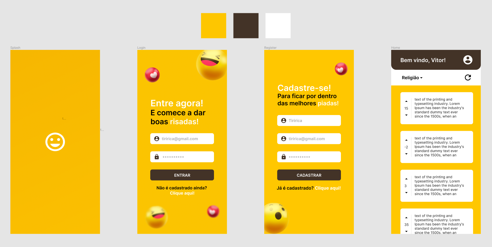

<!-- PROJECT LOGO -->
<h1 align="center">
 
  
 
 
Jokes App
</h1>

<!-- ABOUT THE PROJECT -->
## :bulb: Sobre o Projeto

Este projeto trata-se de aplicativo mobile nativo, com autenticação, que apresenta à seus usuários diversas piadas que podem ser rankeadas por um sistema de up/down vote. A proposta é conceber uma rede social auto-sustentável, com avaliação e inserção de piadas pelos próprios usuários.

<!-- TECHNOLOGIES -->
## :construction: Feito Com
Segue abaixo o que foi utilizado na criação deste aplicativo:

- ⚛️ [ReactNative](https://reactnative.dev/)
- 🔥 [Firebase](https://firebase.google.com/)
- 🚚 [API de piadas](https://v2.jokeapi.dev/)

<!-- DEMONSTRATION -->
## :alembic: Demonstração
Para ilustrar melhor o projeto, abaixo estão algumas demonstrações:

### Prototipação

### Login/Registro

### Feed

<!-- CONTACT -->
## :speech_balloon: Contato
🔘 LinkedIn - [Clique Aqui](https://www.linkedin.com/in/vitormachado-code/)

